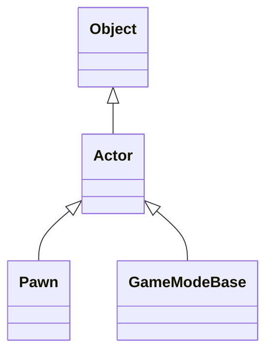

# Ix2dEngine Doc
## 一.引擎结构
object->Actor->Pawn
             ->GameModeBase

## 二. 核心模块
### 1. 主模块
#### 🎮 Actor 模块
- 描述：场景中一切元素的基类
- **常用接口**：
    - [`Tick()`](./)
    - [`SetPosition()`](./)

    <details>
    <summary>查看更多</summary>
  
    - [`SetPosition()`](./)

    </details>

### 🧍 Pawn 模块
- 描述：可被玩家或 AI 控制的角色

### 🎲 GameModeBase
- 描述：游戏规则与流程控制类

---
### 2. 子系统

#### (1) EnhancedInputSubSystem
- **描述**：提供玩家输入事件
- **接口**：

```cpp
void AddInputEventBool(
    SDL_Scancode scancode, 
    std::function<void(EnhancedInputParam<bool>)> func
);
```
**参数说明**:

- `scancode`：_描述按键的枚举值_

- `func`：_事件回调函数_
- 使用方法：
内联调用`func`。


## 3. 类关系图
（可以插入 UML 图或者用 Mermaid）


典型的无异议构造（已修复）
```cpp
//绑定了GC关系，但ptr为局部变量，导致内存泄漏
auto ptr = ConstructObjectFromClass(new Actor(Transform{{500,500}}));
```

```cpp
//使用最直接的方法在指定场景组件下挂载组件，推荐使用变量存储常用的组件
Cast<CollisionBox>(Root->GetSceneComponentByName("碰撞箱").Get())
    ->SetBoundBox(Cast<StaticTexture>(Root->GetSceneComponentByName("DTexture").Get())->GetSize());
```

widget提供slot数量和自身尺寸，计算slot的大小，slot将大小传递给包裹的widget，递归

release模式下相比debug模式下性能提升200000%


Widget创建流程

CreateWidget（）创建一个控件实例

AddChild（） 将控件的实例绑定进调用者的槽中
内部：多态CreateSlot生产不同类的专属槽，绑定传入的控件和槽，然后将这个槽ReceiveSlot()返回给多态自身,让多态类自己去处理槽，最后把这个槽函数返回给外部用
在addchild时会触发或绑定ConstructEvent()

事件委托：
委托者AddCustomEvent（）创建自定义事件，ListenDispatcher（调用者指针，调用者分发器，委托事件名）绑定到调用者的事件分发器
调用者CallDispatcher()，遍历所有绑定到分发器的委托者指针，然后通过这个指针和委托事件名去让委托者自己去执行事件

